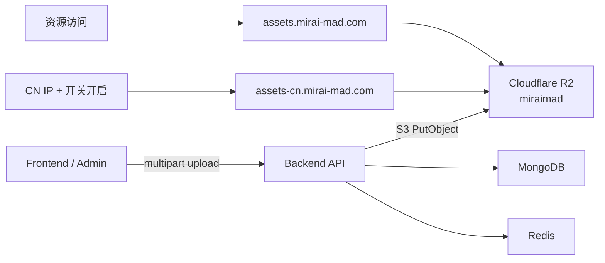
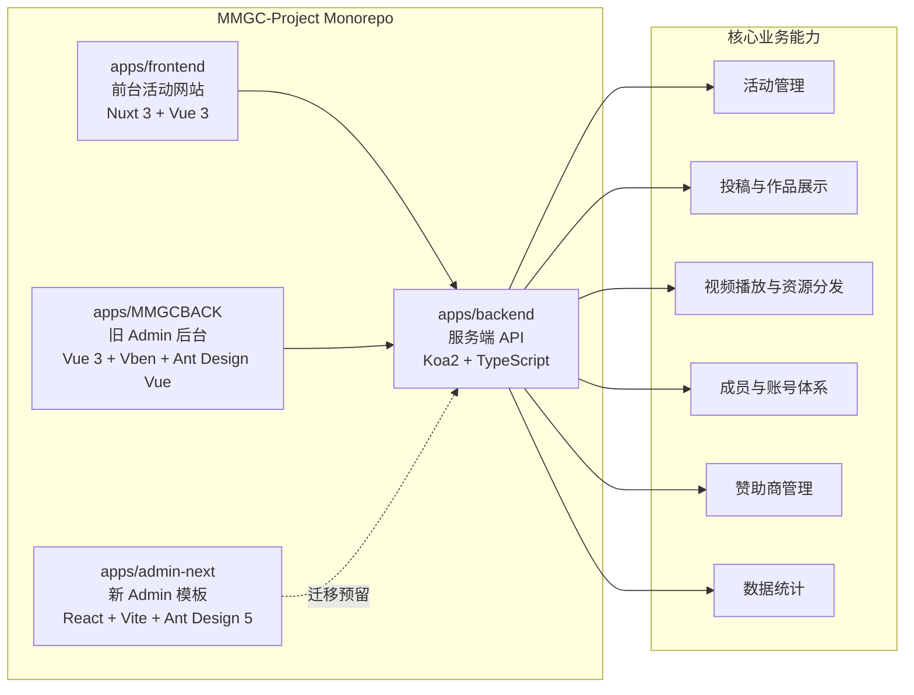

# 活动网站解决方案

MMGC Project 是面向活动官网、投稿展示、视频资源分发和后台运营管理的一套活动网站解决方案。项目以 `mirai-mad.com` 为主站入口，同时兼顾国内访问、海外访问、视频与静态资源 CDN 分发、API 源站直连和 Admin 后台管理。

当前仓库采用 pnpm workspace 管理，包含前台站点、服务端 API、旧 Admin 后台和新 Admin 模板预留目录。

## 线上域名与部署链路

资源上传统一由后端写入 Cloudflare R2，浏览器不会接触 R2 Access Key 或 Secret。资源访问默认使用 `assets.mirai-mad.com`，不再按海外 IP 返回 `assets-global` 域名。系统配置中的“中国大陆资源加速”开关开启后，仅当上游传入 `CF-IPCountry: CN` 时使用 `assets-cn.mirai-mad.com`。

| 域名 | 用途 | 规则 |
| --- | --- | --- |
| `mirai-mad.com` | 主站入口 | 前台站点与 API 入口 |
| `assets.mirai-mad.com` | 默认资源域名 | 所有地区默认使用，绑定 R2 bucket `miraimad` |
| `assets-cn.mirai-mad.com` | 中国大陆加速域名 | 仅在开关开启且识别到 CN IP 时使用 |
| API 源站 | 上传与业务接口 | 接收前后台文件并服务端上传到 R2 |



## 工程架构



### 前台站点：`apps/frontend`

前台站点负责活动官网展示、作品展示、视频播放、投稿入口、多语言页面和 SEO。技术栈以 Nuxt 3、Vue 3、Pinia、Element Plus、Varlet UI、UnoCSS 为主。

常用命令：

```powershell
corepack pnpm --filter mirai-offcial-website run dev
corepack pnpm --filter mirai-offcial-website run dev:online
corepack pnpm --filter mirai-offcial-website run build
```

### 服务端：`apps/backend`

服务端提供统一 REST API，负责活动、作品、用户、投稿、评论、赞助商、统计、邮件、资源上传和第三方服务对接。技术栈以 Koa2、TypeScript、Mongoose、Redis、JWT 和 Cloudflare R2 的 S3 兼容 SDK 为主。

常用命令：

```powershell
corepack pnpm --filter mmgc_backend run dev
corepack pnpm --filter mmgc_backend run check-types
corepack pnpm --filter mmgc_backend run build
```

### Admin 后台：`apps/MMGCBACK`

旧 Admin 是当前线上可用后台，负责运营侧的数据管理、活动管理、视频管理、投稿管理、表单配置、富文本编辑和数据看板。它基于 Vue 3、Vite、Vue Vben Admin、Ant Design Vue、ECharts 构建。

常用命令：

```powershell
corepack pnpm --filter @mmgc/admin run dev
corepack pnpm --filter @mmgc/admin run dev:adminonline
corepack pnpm --filter @mmgc/admin run build
```

### 新 Admin 模板：`apps/admin-next`

`apps/admin-next` 是新后台模板预留目录，目标是用更低复杂度的 React + Vite + Ant Design 5 + TanStack Query 逐步替换旧后台的业务页面。新旧后台需要并行运行，优先迁移登录、Dashboard、视频管理、活动管理和投稿表单。

常用命令：

```powershell
corepack pnpm --filter @mmgc/admin-next run dev
corepack pnpm --filter @mmgc/admin-next run build
```

## 项目结构

```text
MMGC-Project/
├─ apps/
│  ├─ frontend/      # 前台活动网站，Nuxt 3 SSR
│  ├─ backend/       # 服务端 API，Koa2 + TypeScript
│  ├─ MMGCBACK/      # 当前线上 Admin 后台，Vue 3 SPA
│  └─ admin-next/    # 新 Admin 模板与迁移预留
├─ env/              # 环境变量模板与部署配置说明
├─ .github/          # GitHub Actions 工作流
├─ docker-compose.yml
├─ docker-compose.production.yml
├─ package.json
├─ pnpm-workspace.yaml
├─ pnpm-lock.yaml
└─ turbo.json
```

## 本地开发

### 环境要求

- Node.js：与仓库脚本和部署环境保持一致
- pnpm：`pnpm@9.15.4`
- MongoDB
- Redis

### 安装依赖

```powershell
corepack enable
corepack pnpm install
```

### 启动所有工作区开发服务

```powershell
corepack pnpm run dev
```

### 常用端口

| 服务 | 默认端口 | 说明 |
| --- | --- | --- |
| Frontend | `3000` | Nuxt 前台站点 |
| Backend | `8055` | REST API，默认路径 `/mmgcApi` |
| Admin | `8080` | 旧 Admin 后台 |
| MongoDB | `27017` | 数据库 |
| Redis | `6379` | 缓存 |

## Docker 部署

```powershell
docker compose up -d
docker compose logs -f
```

生产环境可叠加 production compose：

```powershell
docker compose -f docker-compose.yml -f docker-compose.production.yml up -d
```

更完整的上线说明见：

- [AI Agent 部署指南](./docs/deployment-ai-agent.md)
- [人类部署指南](./docs/deployment-human.md)
- [Nginx 示例配置](./env/nginx.mmgc.conf.example)

## 验证命令

按改动范围选择运行：

```powershell
corepack pnpm install --frozen-lockfile
corepack pnpm --filter mmgc_backend run build
corepack pnpm --filter mirai-offcial-website run build
corepack pnpm --filter @mmgc/admin run build
corepack pnpm --filter @mmgc/admin-next run build
corepack pnpm run build
```

Docker 相关改动可按需验证：

```powershell
docker build -f apps/backend/Dockerfile -t mmgc-backend-test .
docker build -f apps/frontend/Dockerfile -t mmgc-frontend-test .
docker build -f apps/MMGCBACK/Dockerfile -t mmgc-admin-test .
```

## 不触发 Workflow 的 Push

当前 GitHub Actions 只在 `master` 分支 push 时触发部署。仅同步文档、TODO 或不希望触发部署时，优先推到非 `master` 分支：

```powershell
git switch -c docs/update-deployment-guide
git push origin docs/update-deployment-guide
```

如果必须直接推 `master`，在提交信息中加入 GitHub Actions 支持的跳过标记：

```powershell
git commit -m "docs: update deployment guide [skip ci]"
git push origin master
```

可用标记包括 `[skip ci]`、`[ci skip]`、`[no ci]`、`[skip actions]`、`[actions skip]`。不要使用 `git push -o ci.skip`，这是 GitLab 常见写法，不能作为 GitHub Actions 的跳过方式。

如果仓库启用了 required checks，被跳过的检查可能保持 Pending，PR 可能因此无法合并；这种情况下推一个不带跳过标记的新提交即可重新触发检查。

## 维护约定

- 使用仓库声明的 `pnpm@9.15.4`。
- 新依赖必须同步更新根 `pnpm-lock.yaml`。
- 旧 Admin 位于 `apps/MMGCBACK`，短期仍作为线上后台，不要因新模板迁移破坏旧后台。
- 新 Admin 位于 `apps/admin-next`，迁移时必须复用现有后端接口契约。
- API 请求默认直连源站，静态资源和视频资源按国内、海外域名分别走 CDN 链路。
